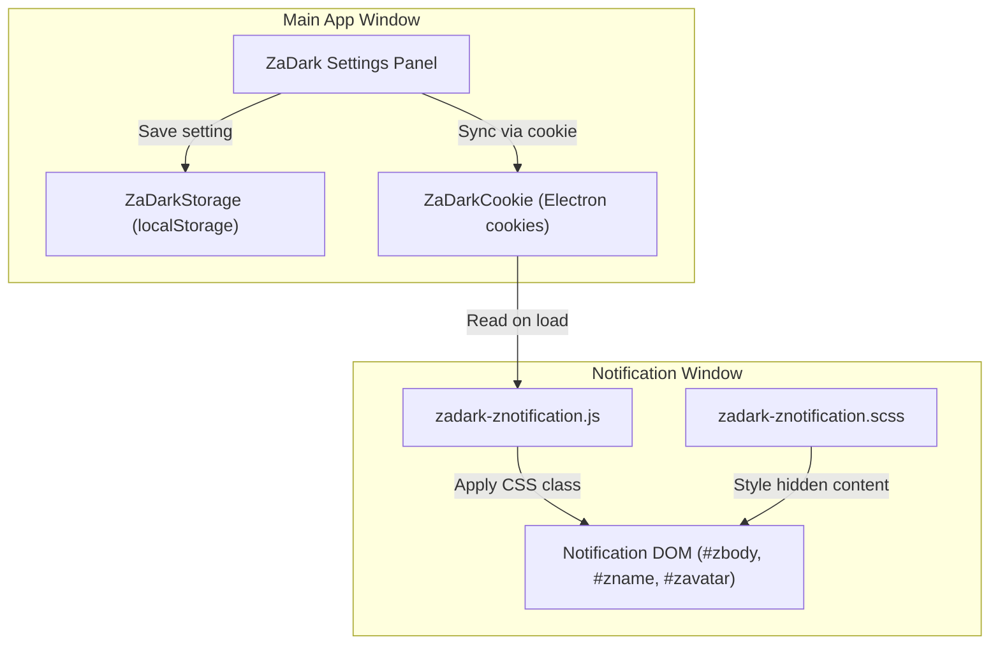

# Design Document: Hide Notification Content

## Overview

This feature adds privacy controls for Zalo PC desktop notifications, allowing users to hide message content and sender names in notification popups. The implementation leverages ZaDark's existing architecture for privacy settings, using cookies to synchronize settings between the main application window and the notification window (which runs as a separate Electron BrowserWindow).

The notification window (`znotification.html`) already has CSS infrastructure for content hiding (currently commented out), and the main app has established patterns for privacy toggles that this feature will follow.

## Architecture



### Data Flow

1. User toggles setting in ZaDark Settings Panel
2. Setting is saved to localStorage (for main app persistence)
3. Setting is also saved as a cookie via `ZaDarkCookie.set()` (for cross-window access)
4. Notification window reads cookie on load via Electron session cookies API
5. Notification JS applies appropriate CSS class to body element
6. CSS rules hide/show content based on body class

## Components and Interfaces

### 1. Storage Layer (`src/pc/assets/js/zadark.js`)

New storage keys and methods in `ZaDarkStorage`:

```javascript
// Storage keys
const ZADARK_ENABLED_HIDE_NOTIFICATION_CONTENT_KEY = '@ZaDark:ENABLED_HIDE_NOTIFICATION_CONTENT'
const ZADARK_ENABLED_HIDE_NOTIFICATION_SENDER_KEY = '@ZaDark:ENABLED_HIDE_NOTIFICATION_SENDER'

// ZaDarkStorage methods
saveEnabledHideNotificationContent: (isEnabled) => {
  ZaDarkCookie.set(ZADARK_ENABLED_HIDE_NOTIFICATION_CONTENT_KEY, isEnabled ? 'true' : 'false')
  return localStorage.setItem(ZADARK_ENABLED_HIDE_NOTIFICATION_CONTENT_KEY, isEnabled)
}

getEnabledHideNotificationContent: () => {
  return localStorage.getItem(ZADARK_ENABLED_HIDE_NOTIFICATION_CONTENT_KEY) === 'true'
}

saveEnabledHideNotificationSender: (isEnabled) => {
  ZaDarkCookie.set(ZADARK_ENABLED_HIDE_NOTIFICATION_SENDER_KEY, isEnabled ? 'true' : 'false')
  return localStorage.setItem(ZADARK_ENABLED_HIDE_NOTIFICATION_SENDER_KEY, isEnabled)
}

getEnabledHideNotificationSender: () => {
  return localStorage.getItem(ZADARK_ENABLED_HIDE_NOTIFICATION_SENDER_KEY) === 'true'
}
```

### 2. UI Components (`src/pc/assets/js/zadark.js`)

New toggle switches in the settings panel HTML:

```javascript
// Element names
const switchHideNotificationContentElName = '#js-switch-hide-notification-content'
const switchHideNotificationSenderElName = '#js-switch-hide-notification-sender'

// HTML for toggles (added to popupMainHTML)
<div class="zadark-switch">
  <label class="zadark-switch__label zadark-switch__label--helper" for="js-switch-hide-notification-content">
    Ẩn <strong>Nội dung thông báo</strong>
    <i class="zadark-icon zadark-icon--question" data-tippy-content='Nội dung tin nhắn trong thông báo sẽ được thay thế bằng ••••••'></i>
  </label>
  <span class="zadark-switch__hotkeys">
    <span class="zadark-hotkeys" data-keys-win="Ctrl+8" data-keys-mac="⌘8"></span>
  </span>
  <label class="zadark-switch__checkbox">
    <input class="zadark-switch__input" type="checkbox" id="js-switch-hide-notification-content">
    <span class="zadark-switch__slider"></span>
  </label>
</div>
```

### 3. Notification Window JS (`src/pc/assets/js/zadark-znotification.js`)

Enhanced to read settings from cookies and apply CSS classes:

```javascript
// Read settings from Electron session cookies
const loadPrivacySettings = async () => {
  try {
    // Access cookies via Electron's session API
    const cookies = await window.electronAPI?.getCookies?.({ domain: 'zadark.com' }) || []
    
    const hideContent = cookies.find(c => c.name === '@ZaDark:ENABLED_HIDE_NOTIFICATION_CONTENT')?.value === 'true'
    const hideSender = cookies.find(c => c.name === '@ZaDark:ENABLED_HIDE_NOTIFICATION_SENDER')?.value === 'true'
    
    if (hideContent) {
      document.body.classList.add('zadark-prv--notification-content')
    }
    if (hideSender) {
      document.body.classList.add('zadark-prv--notification-sender')
    }
  } catch (error) {
    console.error('ZaDark: Failed to load notification privacy settings', error)
  }
}
```

### 4. Notification CSS (`src/core/scss/zadark-znotification.scss`)

CSS rules for hiding notification content:

```scss
.zadark {
  // Hide notification message content
  &.zadark-prv--notification-content {
    #zbody {
      position: relative;
      color: transparent !important;
      
      &::after {
        content: "••••••";
        position: absolute;
        top: 0;
        left: 0;
        width: 100%;
        height: 100%;
        display: flex;
        align-items: center;
        color: var(--text-secondary);
        font-size: 16px;
        letter-spacing: 1px;
      }
    }
  }
  
  // Hide notification sender name
  &.zadark-prv--notification-sender {
    #zname {
      position: relative;
      color: transparent !important;
      
      &::after {
        content: "••••••";
        position: absolute;
        top: 0;
        left: 0;
        width: 100%;
        height: 100%;
        display: flex;
        align-items: center;
        color: var(--text-primary);
        font-size: 16px;
        letter-spacing: 1px;
      }
    }
  }
}
```

## Data Models

### Settings Storage

| Key | Type | Default | Description |
|-----|------|---------|-------------|
| `@ZaDark:ENABLED_HIDE_NOTIFICATION_CONTENT` | boolean (string) | 'false' | Hide message content in notifications |
| `@ZaDark:ENABLED_HIDE_NOTIFICATION_SENDER` | boolean (string) | 'false' | Hide sender name in notifications |

### CSS Classes

| Class | Applied To | Effect |
|-------|-----------|--------|
| `zadark-prv--notification-content` | `body` | Hides `#zbody` content with placeholder |
| `zadark-prv--notification-sender` | `body` | Hides `#zname` content with placeholder |

## Correctness Properties

*A property is a characteristic or behavior that should hold true across all valid executions of a system-essentially, a formal statement about what the system should do. Properties serve as the bridge between human-readable specifications and machine-verifiable correctness guarantees.*

Based on the prework analysis, the following properties have been identified:

### Property 1: Notification content toggle behavior
*For any* notification content string and toggle state, when the hide notification content setting is enabled, the displayed content should be the placeholder pattern (••••••), and when disabled, the displayed content should be the original message.
**Validates: Requirements 1.1, 1.2**

### Property 2: Notification sender toggle behavior
*For any* sender name string and toggle state, when the hide notification sender setting is enabled, the displayed sender should be the placeholder pattern (••••••), and when disabled, the displayed sender should be the original name.
**Validates: Requirements 4.1, 4.2**

### Property 3: Settings persistence round-trip
*For any* boolean setting value (true/false), saving the notification privacy settings and then reading them back should return the same values.
**Validates: Requirements 1.4, 4.4**

### Property 4: Settings independence
*For any* combination of hide content and hide sender settings, changing one setting should not affect the value of the other setting.
**Validates: Requirements 4.3**

## Error Handling

### Cookie Access Failures
- If Electron cookie API is unavailable, fall back to default (show content)
- Log error to console for debugging
- Do not crash the notification window

### Missing DOM Elements
- Check for element existence before applying styles
- Gracefully handle cases where notification structure changes

### Storage Failures
- If localStorage is unavailable, settings won't persist but current session should work
- If cookie setting fails, notification window won't receive updates until restart

## Testing Strategy

### Unit Testing
- Test `ZaDarkStorage` methods for saving/retrieving notification privacy settings
- Test CSS class application logic in notification JS
- Test toggle state management in settings panel

### Property-Based Testing

The project will use **fast-check** as the property-based testing library for JavaScript.

Each property-based test must:
- Run a minimum of 100 iterations
- Be tagged with a comment referencing the correctness property: `**Feature: hide-notification-content, Property {number}: {property_text}**`
- Generate random inputs appropriate for the property being tested

**Property Tests to Implement:**

1. **Property 1 Test**: Generate random message strings, test that toggle state correctly determines whether placeholder or original content is shown
2. **Property 2 Test**: Generate random sender names, test that toggle state correctly determines whether placeholder or original name is shown  
3. **Property 3 Test**: Generate random boolean values, test save/load round-trip for both settings
4. **Property 4 Test**: Generate random combinations of both settings, verify changing one doesn't affect the other

### Integration Testing
- Manual testing of notification appearance on macOS and Windows
- Verify settings sync between main app and notification window
- Test keyboard shortcuts functionality
